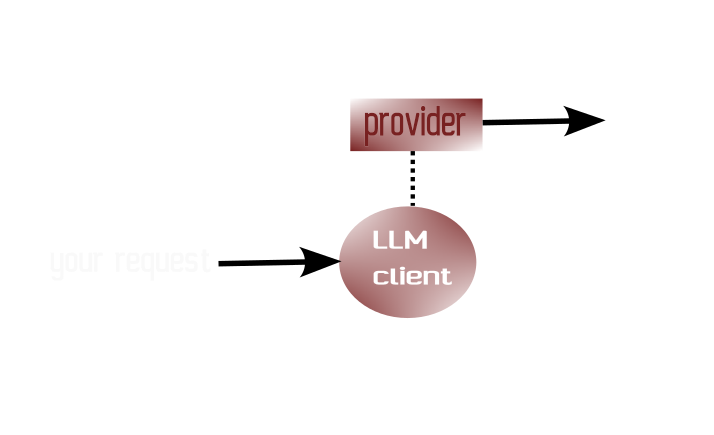

# llm-client

LLM-client is a lightweight JavaScript library that provides a unified REST API interface for interacting with various language models (Ollama, ChatGPT, Mistral, etc.). It abstracts provider-specific details into modular plugins, offering a simple and consistent way to integrate multiple LLM services into your applications.

(c) 2026 Alexandre Brillant

https://github.com/AlexandreBrillant/llm-client

Features

- No external dependencies
- Easy to use
- Supports both streaming and non-streaming requests
- Simplified context management


LLM-Client supports :

- OLLAMA
- OLLAMA Cloud
- OpenAI
- Anthropic
- Google
- MistralAI

Environment Support

LLM-Client is designed to run in both browser (web) and Node.js environments. It uses standard ESM (ECMAScript Modules) for compatibility across platforms.

# Architecture

LLM-Client uses access providers. Each provider is specific to a cloud client (OpenAI, etc.).

 

# Requests

LLM-Client supports the same request types across all providers:

## Simple Request :

A request is an array of objects in the format { role:"", content:"" }. The role designates the type of request: user, system, or assistant.

```javascript
[
    { role:"user", content:"My request" }
]
```

## System and User Request

```javascript
[
    { role:"system", content:"Be funny" },
    { role:"user", content:"My request" }
]
```

## Multi-turn Request

```javascript
[
    { role:"user", content:"Hello, how do you do ?" },
    { role:"assistant", content:"Well..." },
    { role:"user", content:"And after ?" }
]
```
# Responses

The response is always in the following format:

```javascript
{ message: {
    role:'assistant', 
    content:'my llm response'
  }
}
```

- Without streaming : The response is complete
- With streaming : The response is split into chunks and sent as they become available

## Without Streaming

```javascript
{ message: { role:'assistant', content:'I m very happy to meet you' } }
```

## With Streaming

The response is split into multiple parts and sent incrementally:

```javascript
{ message: { role:'assistant', content:'I m very' } }
{ message: { role:'assistant', content:'happ' } }
{ message: { role:'assistant', content:'y to meet' } }
{ message: { role:'assistant', content:'you' } }
```

# Usage

LLM-Client uses standard ESM modules.

## Import the LLM-client Class

You must adapt each access path to your usage

```javascript
import { LLMClient } from "./llmClient.mjs";
```

## Choose a Provider

Here, we use Ollama as an example :

```javascript
import { OllamaProvider as MyProvider } from "./providers/ollama.mjs";
```

## Create a Provider instant and initialize LLMClient

```javascript
const provider = new MyProvider();
const client = new LLMClient( provider );
```

## Fetch Available models

```javascript
const models = await client.models();

models.forEach( model => {
    console.log( "-" + model.name )
});
```

## Send a Request

Select a model (e.g. ministral-3:3b) and send a request

```javascript
const model = "ministral-3:3b";
const messages = [ 
    { role : "user", content : "hello" },
];

let stream = false;

let response = await client.chat( { model, messages, stream } );
console.log( response.message.content );
```

## Enable Streaming

To display the response incrementally in the terminal we use the Node.js process objet. For
other context (like a web page), you will have to concat each result.

```javascript
// With streaming
stream = true;

const messages = [ 
    { role : "system", content : "be concise" }
    { role : "user", content : "hello" },
];

const response2 = await client.chat( { model, messages, stream } );
for await ( response of response2 ) {
    process.stdout.write( response.message.content );
}
```

# Cloud Providers

You need an API key from each cloud provider. Pass the key using the **setAPIKey** method.

## Ollama Cloud

```javascript
import { LLMClient } from "./llmClient.mjs";
import { OllamaCloudProvider as MyProvider } from "./providers/ollamaCloud.mjs";

const provider = new MyProvider();
const client = new LLMClient( provider );

client.setAPIKey( YOUR_API_KEY );
```

## OpenAI

```javascript
import { LLMClient } from "./llmClient.mjs";
import { OpenAIProvider as MyProvider } from "./providers/openai.mjs";

const provider = new MyProvider();
const client = new LLMClient( provider );

client.setAPIKey( YOUR_API_KEY );
```

## Anthropic

```javascript
import { LLMClient } from "./llmClient.mjs";
import { AnthropicProvider as MyProvider } from "./providers/anthropic.mjs";

const provider = new MyProvider();
const client = new LLMClient( provider );

client.setAPIKey( YOUR_API_KEY );
```

## Google

```javascript
import { LLMClient } from "./llmClient.mjs";
import { GoogleProvider as MyProvider } from "./providers/google.mjs";

const provider = new MyProvider();
const client = new LLMClient( provider );

client.setAPIKey( YOUR_API_KEY );
```

## MistralAI

```javascript
import { LLMClient } from "./llmClient.mjs";
import { MistralAIProvider as MyProvider } from "./providers/mistralai.mjs";

const provider = new MyProvider();
const client = new LLMClient( provider );

client.setAPIKey( YOUR_API_KEY );
```

(c) 2026 Alexandre Brillant